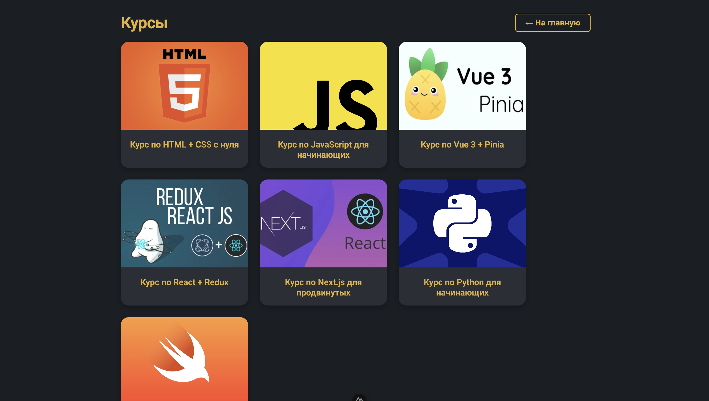
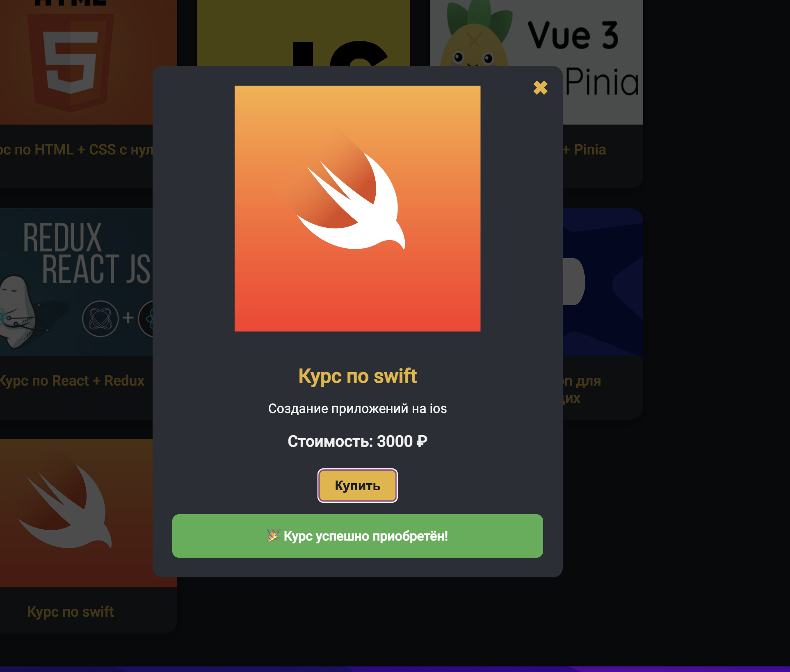
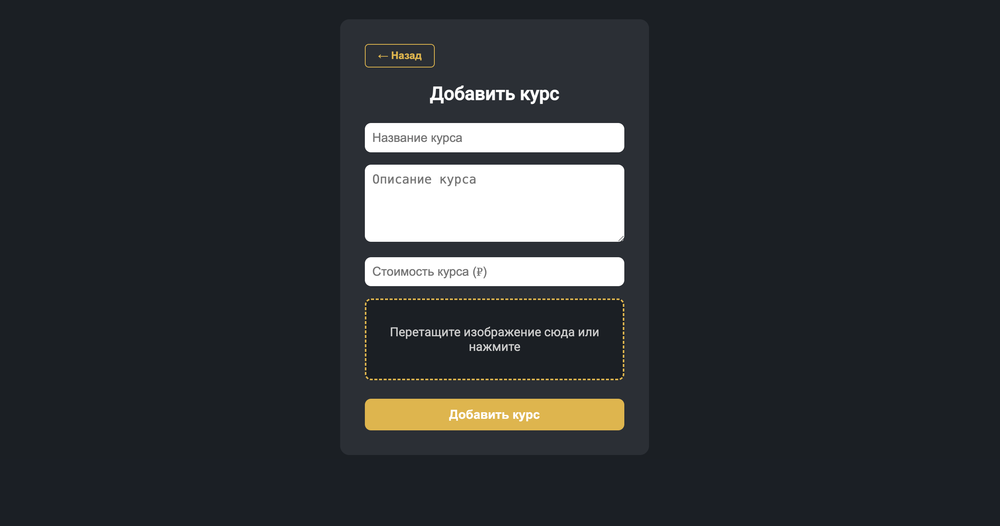
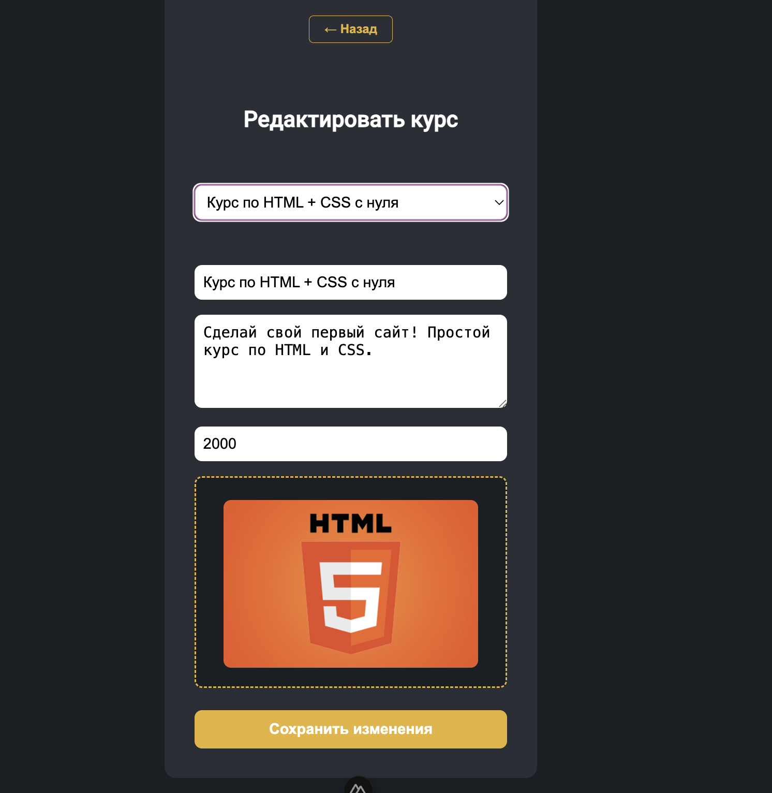
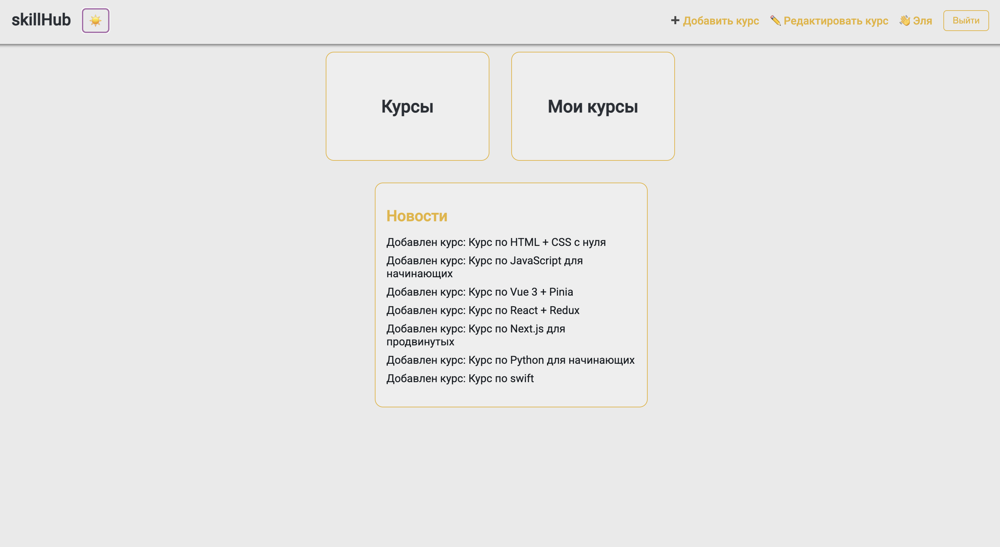
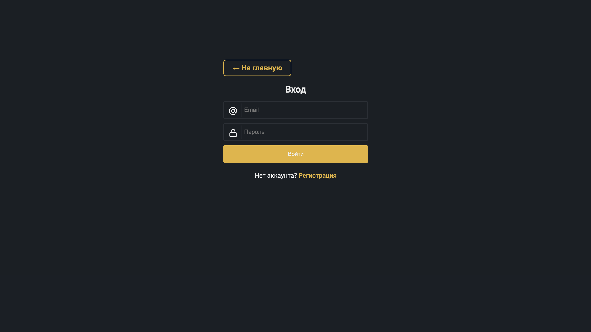
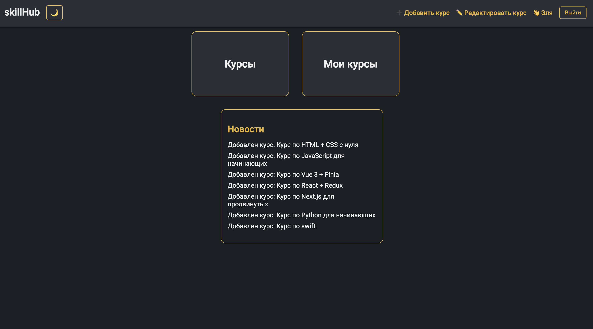

# SkillHub — Платформа онлайн-курсов

## Стек технологий

- **Frontend**: Nuxt 3, Vue 3, Pinia, Tailwind CSS v4
- **Color Mode**: Поддержка светлой и тёмной темы
- **Backend**: Laravel 12 + Sanctum
- **Аутентификация**: Sanctum с куками
- **Dev инструменты**: Vite, Vitest, PHPUnit

## Основной функционал

### Пользователи
- Регистрация и вход
- Переключение темы
- Роль администратора (is_admin)

### Администратор
- Добавление новых курсов
- Редактирование существующих курсов

### Курсы
- Просмотр всех курсов
- Покупка курса (добавляется в "Мои курсы")
- Курсы содержат:
  - название
  - описание
  - цену
  - изображение

### Новости
- Отображение новых курсов в блоке "Новости"

## Темы
- Светлая и тёмная тема с возможностью переключения

### Тесты
- Для API написаны feature-тесты и unit-тесты
- Для Vue 3 компонентов написаны unit-тесты 

## Скриншоты интерфейса

### Главная и навигация

| Панель | Курсы | Модaльный экран курса | Покупка курса | Мои курсы |
|--------|-------|-----------------------|---------------|-----------|
|  |  |  | |[]!(src/mycourses.png)|

### Администрирование

| Добавление | Редактирование 1 | Редактирование 2 |
|------------|------------------|------------------|
|  |  |  |

### Темы

| Панель светлая |  
|----------------|
|  | 

### Логин/ Регистрация

| Логин | Регистрация | Панель админа |
|-------|-------------|---------------|
|  |  |  |

## Конфигурация Nuxt (фрагмент `nuxt.config.ts`)

```ts
import { defineNuxtConfig } from 'nuxt/config'

export default defineNuxtConfig({
  compatibilityDate: "2025-05-31",
  css: ['~/assets/css/tailwind.css'],
  modules: [
    '@pinia/nuxt',
    ['@nuxtjs/color-mode'],
  ],
  colorMode: {
    classSuffix: '',
  },
  postcss: {
    plugins: {
      '@tailwindcss/postcss': {},
      autoprefixer: {}
    }
  }
})
```

## Установка и запуск

### Backend (Laravel)

```bash
cd backend
composer install
cp .env.example .env
DB_CONNECTION=sqlite
DB_DATABASE=/full/path/to/backend/database/database.sqlite
DB_USERNAME=youusername
DB_PASSWORD=youpassword

SESSION_DRIVER=file
SESSION_DOMAIN=localhost
SANCTUM_STATEFUL_DOMAINS=localhost:3000,127.0.0.1:3000
php artisan key:generate
php artisan migrate
php artisan serve
```

### Frontend (Nuxt 3)

```bash
npm install
npm install @nuxtjs/color-mode @tailwindcss/postcss pinia 
npm run dev
```

### Ручное администрирование

```bash
UPDATE users SET is_admin = 1 WHERE email = 'example@mail.com';
```

---


